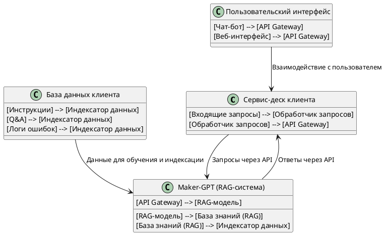

### Схема интеграции системы Maker-GPT в инфраструктуру компании-клиента

Для интеграции системы Maker-GPT в инфраструктуру компании-клиента необходимо обеспечить взаимодействие между следующими компонентами:
1. **Maker-GPT** (RAG-система).
2. **Сервис-деск клиента** (например, Zendesk, Jira Service Desk или кастомное решение).
3. **База данных клиента** (инструкции, Q&A, логи).
4. **API для взаимодействия** между системами.
5. **Пользовательский интерфейс** (чат-бот или веб-интерфейс).

---

### **Схема взаимодействия компонентов**

---

### **Описание компонентов и их взаимодействия:**

1. **Сервис-деск клиента:**
   - **Входящие запросы:** Запросы от клиентов поступают в систему (например, через email, чат или веб-форму).
   - **Обработчик запросов:** Определяет, нужно ли передать запрос в Maker-GPT для автоматической обработки.
   - **API Gateway:** Отправляет запросы в Maker-GPT и получает ответы.

2. **Maker-GPT (RAG-система):**
   - **API Gateway:** Принимает запросы от сервис-деска и передает их в RAG-модель.
   - **RAG-модель:** Обрабатывает запрос, используя базу знаний для генерации ответа.
   - **База знаний (RAG):** Содержит индексированные данные (инструкции, Q&A, логи).
   - **Индексатор данных:** Обновляет базу знаний на основе данных из базы клиента.

3. **База данных клиента:**
   - **Инструкции:** Руководства и документация по оборудованию.
   - **Q&A:** Часто задаваемые вопросы и ответы.
   - **Логи ошибок:** Исторические данные об ошибках и их решениях.

4. **Пользовательский интерфейс:**
   - **Чат-бот:** Интегрирован с сервис-деском для автоматической обработки запросов.
   - **Веб-интерфейс:** Позволяет операторам вручную взаимодействовать с системой.

---

### **Процесс работы системы:**

1. **Поступление запроса:**
   - Клиент отправляет запрос через чат-бот, email или веб-форму.
   - Запрос попадает в сервис-деск.

2. **Обработка запроса:**
   - Сервис-деск определяет, можно ли автоматизировать ответ.
   - Если да, запрос передается в Maker-GPT через API.

3. **Генерация ответа:**
   - Maker-GPT использует RAG-модель для поиска ответа в базе знаний.
   - Ответ возвращается в сервис-деск.

4. **Отправка ответа:**
   - Сервис-деск отправляет ответ клиенту через выбранный канал (чат, email и т.д.).

5. **Обновление базы знаний:**
   - Данные из базы клиента регулярно индексируются и обновляются в Maker-GPT.

---

### **Преимущества схемы:**

1. **Масштабируемость:**
   - Система легко масштабируется за счет использования API и облачной инфраструктуры.

2. **Гибкость:**
   - Возможность интеграции с различными сервис-десками и базами данных.

3. **Автоматизация:**
   - Снижение нагрузки на операторов за счет автоматической обработки запросов.

4. **Актуальность данных:**
   - Регулярное обновление базы знаний обеспечивает высокую точность ответов.

---

### **Рекомендации по реализации:**

1. **API Gateway:**
   - Используйте API Gateway для управления запросами и ответами между системами.
   - Настройте аутентификацию и авторизацию для защиты данных.

2. **Индексация данных:**
   - Регулярно обновляйте базу знаний (например, раз в неделю или месяц).
   - Используйте инструменты для автоматической индексации (например, Elasticsearch).

3. **Мониторинг:**
   - Настройте мониторинг работы системы (логирование, метрики производительности).

4. **Резервное копирование:**
   - Обеспечьте регулярное резервное копирование базы знаний и данных клиента.

---

### **Итог:**
Предложенная схема интеграции обеспечивает эффективное взаимодействие между Maker-GPT и инфраструктурой компании-клиента. Использование API и модульной архитектуры позволяет легко адаптировать систему под конкретные требования и масштабировать ее в будущем.
